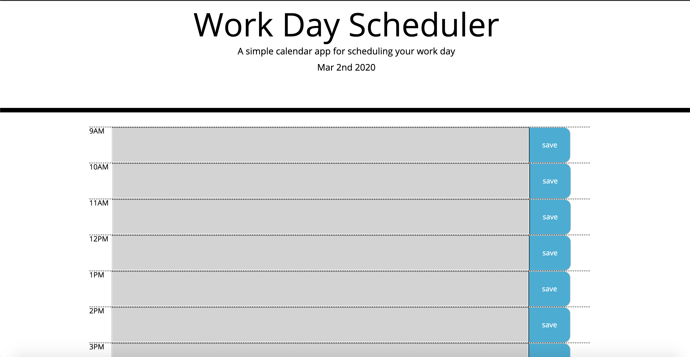

# Vanderbilt Coding Bootcamp homework assignment #5

# Website link

(https://bg9892.github.io/bootcamp-h5/)

## Notes

- Work day scheduler.
- Schedule your time in 1 hour blocks.
- Past blocks are gray, present is red, and future is green.
- Clicking the save button stores schedule in local storage.
- Main html content dynamically updated by Jquery.
- Date and time is made using the moment.js library.

# Screenshots

